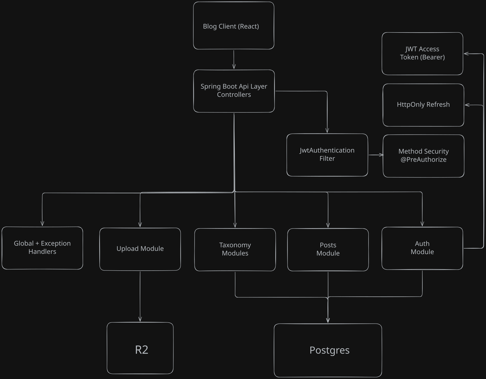

# Logbook Blog Backend (Spring Boot)

## Overview
This project is the backend API for a blog platform, designed to support a separately hosted React frontend. It provides authenticated author workflows, public content delivery, taxonomy management (categories and tags), and direct-to-cloud image uploads. The codebase is structured by feature modules with clear controller/service/repository boundaries. Security is implemented with short-lived JWT access tokens and rotating refresh tokens stored server-side.

## Tech Stack
- Language & Runtime: Java 21
- Framework: Spring Boot 3 (Web, Validation, Security, Data JPA)
- Database: PostgreSQL
- Auth: Spring Security + JWT (JJWT) + refresh token rotation
- Object Storage: Cloudflare R2 (S3-compatible presigned uploads)
- Mapping & Boilerplate: MapStruct, Lombok
- Build Tool: Maven
- Local Infra: Docker Compose (Postgres + Adminer)

## Core Features
- JWT-based authentication (`login`, `register`, `me`) with refresh-token cookie flow.
- Role-based and ownership-based authorization for protected endpoints.
- Post lifecycle support with `DRAFT` and `PUBLISHED` states.
- Public post listing with pagination and filtering by category/tag.
- Category and tag CRUD (admin-controlled writes).
- Presigned upload endpoints for post cover images and user avatars (direct client upload to R2).
- Consistent API error responses with feature-scoped and global exception handling.

## Architecture Overview


### API & Data Flow
1. Request enters a feature controller (`auth`, `posts`, `tags`, `categories`, `upload`).
2. Service layer applies business logic and validation rules.
3. Repository layer executes persistence operations via Spring Data JPA.
4. MapStruct maps entities to DTOs for API responses.
5. Errors are translated into standard API error payloads via `@RestControllerAdvice`.

### Security Model
- Access token: Bearer JWT in `Authorization` header.
- Refresh token: HttpOnly cookie scoped to auth routes.
- A custom JWT filter authenticates requests and populates `SecurityContext`.
- Method-level security (`@PreAuthorize`) enforces role/ownership checks where needed.

### Storage & Upload Flow
1. Frontend requests a presigned upload URL from `/api/v1/uploads/presign/...`.
2. Backend validates content type and generates a short-lived signed `PUT` URL.
3. Frontend uploads directly to R2.
4. Backend persists/returns the resulting public asset URL in subsequent resource updates.

## Database Design
Key modeling decisions:
- `users` -> `posts`: one-to-many (author owns posts).
- `posts` -> `categories`: many-to-one (single category per post).
- `posts` <-> `tags`: many-to-many via `post_tags`.
- `refresh_tokens`: one active refresh token record per user (unique `user_id`), stored as hash.
- `PostStatus` enum (`DRAFT`, `PUBLISHED`) separates authoring content from public content.

## Tradeoffs & Future Improvements
- Current design optimizes for clarity and maintainability over advanced query performance.
- Post filtering uses repository-derived methods; future growth may benefit from specifications/query DSL.
- Refresh token model is single-session-per-user; multi-device session tracking can be added.
- Add integration tests for security flows and upload signing behavior.
- Move all secrets to environment-only configuration for safer local/dev defaults.
- Expand observability (structured logging, request tracing, metrics dashboards).

## Getting Started
### 1. Prerequisites
- Java 21+
- Maven (or use `./mvnw`)
- Docker (optional, for local Postgres/Adminer)

### 2. Start local services (optional)
```bash
docker compose up -d
```

### 3. Configure environment
Use environment variables (recommended), especially for production:
- `PORT`
- `PGHOST`, `PGPORT`, `PGDATABASE`, `PGUSER`, `PGPASSWORD`
- `JWT_SECRET`
- `REFRESH_PEPPER`
- `COOKIE_SECURE`, `COOKIE_SAMESITE`
- `R2_ENDPOINT`, `R2_BUCKET`, `R2_ACCESS_KEY_ID`, `R2_SECRET_ACCESS_KEY`, `R2_PUBLIC_BASE_URL`, `R2_REGION`

### 4. Run the app
```bash
./mvnw spring-boot:run
```

### 5. Run tests
```bash
./mvnw test
```
